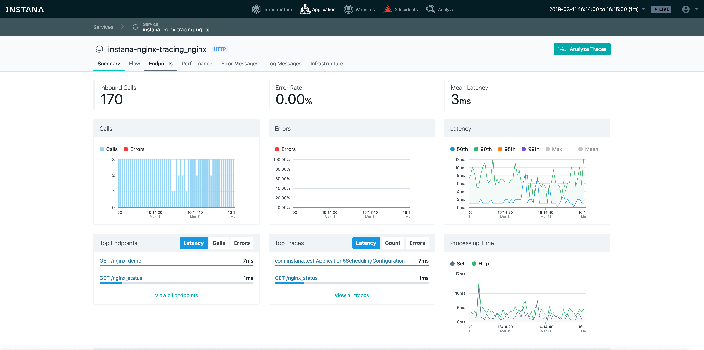
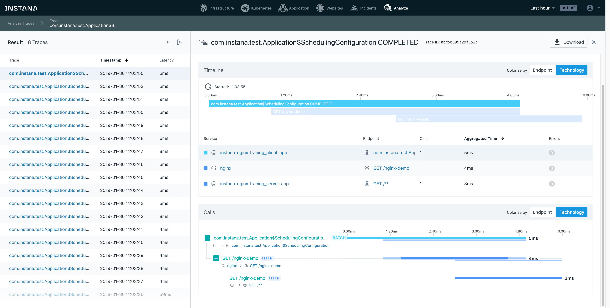

# Instana NGINX Tracing Demo

This repository contains a demo for Instana's [NGINX](https://www.nginx.com/) tracing functionality.

## Prerequisites

A `docker-compose` installation running on your machine. This demo has been created and tested on Mac OS X with `docker-compose` and `docker-machine`.

## Configure

Create a `.env` file in the root of the checked-out version of this repository and enter the following text, with the values adjusted as necessary:

```text
agent_key=<TODO FILL UP>
agent_endpoint=<local ip or remote host; e.g., saas-us-west-2.instana.io>
agent_endpoint_port=<443 already set as default; or 4443 for local>
agent_zone=<name of the zone for the agent; default: envoy-tracing-demo>
```

## Build

```bash
pushd client-app
./mvnw clean package
popd

pushd server-app
./mvnw clean package
popd

docker-compose build
```

## Launch

```bash
docker-compose up
```

This will build and launch

- `client-app` service, a simple Spring Boot application that issues a request every second to the ...
- `nginx` service, which routes all incoming requests to the ...
- `server-app` service, a simple Spring Boot application that returns `200` to any HTTP request.

After the agent is bootstrapped and starts accepting spans from NGINX, the resulting traces in the Analyze view will look like the following:





Naturally, all the other [NGINX capabilities of Instana](https://docs.instana.io/ecosystem/nginx/) will work out of the box as well ;-)

## Setup an Application Perspective for the Demo

The simplest way is just to assign to the agent a unique zone (the `docker-compose.yml` file comes with the pre-defined `nginx-tracing-demo` zone), and simply create the application to contain all calls with the `agent.zone` tag to have the value `nginx-tracing-demo`.

## Setup NGINX tracing in your own environment

In order to install this technology in your own setup, you will need to:

1. [Get the right binaries](#released-binaries) for your NGINX version
2. [Copy the binaries](#copy-the-binaries) where your NGINX server can access them
3. [Edit the NGINX configurations](#edit-the-nginx-configurations)
4. Restart the NGINX process or [trigger a configuration reload](https://docs.nginx.com/nginx/admin-guide/basic-functionality/runtime-control/#controlling-nginx) sending a `reload` command

### Released Binaries

**Link**: https://artifact-public.instana.io/artifactory/shared/com/instana/libinstana_sensor/<br/>
**HTTP Basic Auth Credentials**: `_:${agent_key}`

Since version 0.7.0, both `linux-amd64-libinstana_sensor.so` and the NGINX OpenTracing module `linux-amd64-nginx-${VERSION}-ngx_http_ot_module.so` are required from Instana in the **same Instana version** for standard GNU/Linux distributions.
The explanation for not supporting any other build of the NGINX OpenTracing module is provided [below](#Support-for-other-NGINX-OpenTracing-module-builds).

Our NGINX Http OpenTracing modules are based on `nginx-opentracing` **v0.9.0**.

#### Which packages should I use

The packages that we offer depend on:

- The NGINX version, as shown by the `nginx -V` command:

  ```sh
  # nginx -V
  nginx version: nginx/1.17.3 (nginx-plus-r19)
  ...
  ```

  The output above shows that the module version 1.17.3 is required for NGINX Plus R19.

- The Libc variant used in your distribution (`glibc` or `musl`); you likely use `glibc`, unless you are using Alpine as base-image for your containers, in which case, it's `musl`.
- (In some cases) the particular distribution (when the build used in some official packages is different enough to require bespoke adjustments on our side)

The list of binaries and download links is available on the [Binaries](binaries.md) page.

### Copy the Binaries

The two binaries you have downloaded in the previous step must be placed on a filesystem that the NGINX process can access, both in terms of locations as well as file permissions.

If NGINX is running directly on the operating system, as opposed to running in a container, it's usually a good choice to copy the two Instana binaries into the folder that contains the other NGINX modules.
You can find where NGINX expects the modules to be located by running the `nginx -V` command and look for the `--modules-path` configuration option, see, e.g., [this response on StackOverflow](https://serverfault.com/a/812994).

In a containerized environment, this may mean to add them to the container image, or mount the files as volumes into the container; see, for example, Docker's [bind mounts](https://docs.docker.com/storage/bind-mounts/) documentation or how to [mount volumes to pods in Kubernetes](https://kubernetes.io/docs/tasks/configure-pod-container/configure-volume-storage/).

### Edit the NGINX Configurations

```nginx
# The following line adds the basic module Instana uses to get tracing data.
# It is required that you use the version of this module built by Instana,
# rather than the one shipped in many NGINX distros, as there are some
# modifications in the Instana version that are required for tracing to work
load_module modules/ngx_http_opentracing_module.so;

# Whitelists environment variables used for tracer configuration to avoid
# that NGINX wipes them. This is only needed if instana-config.json
# should contain an empty configuration with "{}" inside to do the
# configuration via these environment variables instead.
env INSTANA_SERVICE_NAME;
env INSTANA_AGENT_HOST;
env INSTANA_AGENT_PORT;
env INSTANA_MAX_BUFFERED_SPANS;
env INSTANA_DEV;

events {}

error_log /dev/stdout info;

http {
  error_log /dev/stdout info;

  # The following line loads the Instana libsinstana_sensor library, that
  # gets the tracing data from ngx_http_opentracing_module.so and converts
  # them to Instana AutoTrace tracing data.
  # The content of instana-config.json is discussed below.
  opentracing_load_tracer /usr/local/lib/libinstana_sensor.so /etc/instana-config.json;

  # Propagates the active span context for upstream requests.
  # Without this configuration, the Instana trace will end at
  # NGINX, and the systems downstream (those to which NGINX
  # routes the requests) monitored by Instana will generate
  # new, unrelated traces
  opentracing_propagate_context;

  # If you use upstreams, Instana will automatically use them as endpoints,
  # and it is really cool :-)
  upstream backend {
    server server-app:8080;
  }

  server {
    error_log /dev/stdout info;
    listen 8080;
    server_name localhost;

    location /static {
      root /www/html;
    }

    location ^~ /api {
      proxy_pass http://backend;
    }

    location ^~ /other_api {
      proxy_set_header X-AWESOME-HEADER "truly_is_awesome";

      # Using the `proxy_set_header` directive voids for this
      # location the `opentracing_propagate_context` defined
      # at the `http` level, so here we need to set it again
      opentracing_propagate_context;

      proxy_pass http://backend;
    }
  }
}
```

The following is an example of `instana-config.json`:

```json
{
  "service": "nginxtracing_nginx",
  "agent_host": "instana-agent",
  "agent_port": 42699,
  "max_buffered_spans": 1000
}
```

The configurations in the snippet above mean the following:

- `service`: which name will be associated in the Instana backend with this NGINX process.
  If unspecified, service names will be calculated based on, for example, [HTTP host name or other means](https://docs.instana.io/application_monitoring/services/).
- `agent_host`: the IP address or DNS name of the local host agent.
  **You must change this configuration to match the network name of the Instana agent on the same host as the NGINX process**.
- `agent_port`: the port on which the NGINX tracing extension will try to contact the host agent.
  Notice that this port is _not configurable_ agent side.
  The NGINX tracing extension allows you to configure it in case of settings requiring port forwarding or port mapping.
- `max_buffered_spans`: The maximum amount of spans, one per request, that the NGINX tracing extension will keep locally before flushing them to the agent; the default is `1000`.
  Notice that the NGINX tracing extension will always flush the locally-buffered spans every one second.
  This setting allows you to reduce the amount of local buffering when your NGINX server is serving more than `1000` requests per second.

The alternative is to configure the tracer via environment variables. The file `instana-config.json` is still required and its contents takes precedence. So do the following:

- put an empty configuration `{}` into `instana-config.json`
- do the whitelisting of the environment variables in the NGINX configuration as shown above
- set the environment variables before starting NGINX

This method is especially useful to set the Instana agent host to the host IP in a Kubernetes cluster.

The following example Kubernetes deployment YAML part shows this method:

```yaml
        env:
        - name: INSTANA_SERVICE_NAME
          value: "nginxtracing_nginx"
        - name: INSTANA_AGENT_HOST
          valueFrom:
            fieldRef:
              fieldPath: status.hostIP
```

For details see the [Environment Variable Reference](https://www.instana.com/docs/reference/environment_variables).

### Support for other NGINX OpenTracing module builds

We do not support using builds of the NGINX OpenTracing module from 3rd parties, including those supported by NGINX itself.
The reason for requiring the Instana build of the NGINX OpenTracing module is purely technical: we **cannot support self-compilation** (that is, you building your own version, the NGINX module system is too sensitive to build flags) or the modules from F5, because they use dynamic linking to the standard C++ library and that would lead in many cases to **segfault**.
Indeed, to avoid segfault, we use in our build of the NGINX OpenTracing module a statically linked standard C++ library for unifying testing and for the benefit of modern C++ code even on older distributions.

### Kubernetes NGINX Ingress Tracing

There is a technical preview at https://github.com/instana/ingress-nginx-tracing which simplifies the NGINX tracing configuration for Kubernetes NGINX Ingress.

## Release History

### 1.1.1 (2020-08-28)

   * added support for NGINX 1.19.2, OpenResty 1.17.8.2

### 1.1.0 (2020-07-31)

   * fixed the agent discovery if `/proc/$pid/sched` (`CONFIG_SCHED_DEBUG`) is not available

### 1.0.1 (2020-07-21)

   * added support for NGINX 1.19.1, OpenResty 1.17.8.1, 1.15.8.3

### 1.0.0 (2020-06-26)

   * added support for NGINX 1.17.10, 1.18.0, and 1.19.0
   * added support for secrets in URLs configured by the agent
   * added support for hiding synthetic calls like `nginx_status` and `api` requests
   * set new config defaults to avoid the need for `opentracing on;` or `opentracing_trace_locations off;`
   * now providing single file downloads with a list of [supported binaries](binaries.md) for simpler setup

### 0.8.0 (2020-03-30)

   * added support for NGINX 1.17.8 and 1.17.9
   * made MaxBufferedSpans configurable (default `1000`)
      * added `max_buffered_spans` JSON config entry
   * added `Server-Timing` entry (`intid`, for "INstana Trace IDentifier") response header to enable correlation with End-User Monitoring (EUM) for page loads
      * Instana `nginx-opentracing` module is mandatory for this functionality
      * superseeds the `add_header` directive workaround in NGINX config
   * handling correlation part of extended `X-INSTANA-L` header for mobile EUM
   * HTTP extra headers are captured also in root spans
      * requires an Instana backend update (v174) for those heads to be matched by the `call.http.header` filter

### 0.7.0 (2020-01-02)

   * enforcing the use of Instana NGINX OpenTracing modules in same version
      * avoiding segfaults and incompatibilities
   * logging `libinstana_sensor` version upon module load
      * information gathering for better support
   * changed the module suffix from `ngx_http_module` to `ngx_http_ot_module`
      * providing a clear hint that this is about OpenTracing
   * building `ngx_http_ot_module` versions until `1.17.7` and NGINX Plus R20
   * added timestamps and prefix "[lis]" to log messages for better debugging
   * added pid to log messages
   * enforcing IPv4 in agent host name resolution
      * avoiding failure due to IPv6 address for same host name
   * implemented a new discovery request format
      * requiring the C++ sensor 1.1.0 agent part for faster agent connection
   * reworked the agent connection/discovery to quickly connect
      * if no agent host is configured, then the gateway is checked first
   * only logging an error if connections to all agent host candidates fail
      * converted misleading error message upon failure of first candidate
   * increased span flushing interval from 5s to 1s

### 0.6.0 (2019-09-06)

   * building the NGINX OpenTracing modules as well to fix compatibility issues
      * using `nginx-opentracing` release `v0.9.0`

### 0.5.4 (2019-03-20)

   * initial public release

## Debugging

### Version Deprecation

Older versions than 1.0.0 are not supported any more.

### NGINX Binary Signature

NGINX compares the OpenSource NGINX version of modules to be loaded first. If it matches, then it checks a binary signature which is basically a compile feature list.

With `grep` it is possible to read it and to find the module variant with the required binary signature:

```sh
grep --binary-files=text --only-matching "[0-9],[0-9],[0-9],[0-1]\{34\}" ${NGINX_BINARY_OR_MODULE_PATH}
```

If the `binutils` package is installed, then the more precise method is:

```sh
strings ${NGINX_BINARY_OR_MODULE_PATH} | grep "^[0-9],[0-9],[0-9],[0-1]\{34\}$"
```

The typical binary signature with compatibility is `8,4,8,0011111111010111001111111111111111`.

### Debug Logging Libinstana_sensor

Just insert the following line in the middle of the config in `instana-config.json`:

```json
"log_level": "debug",
```

Or if you configure the tracer by environment variables, set `INSTANA_DEV` to "1".

### Firewall Config

In order to reach the Instana agent via IPv4, it is required to use the correct agent hostname which will resolve to the correct IP address and **TCP port 42699** has to be open. Network debugging packages `iproute2`, `iputils-ping`, and `netcat` should be installed.

Example with NGINX in a Ubuntu Docker container and the Instana agent on the host:

```sh
host# ss -tlnp    # verify agent listens to port 42699 at proper IP
host# docker ps
host# docker exec -it ${CONTAINER} /bin/bash
container# apt-get update && apt-get upgrade && apt-get install \
iproute2 iputils-ping netcat
container# ip -s a                   # correct network
container# ping 172.25.0.1           # ping works
container# nc 172.25.0.1 42699       # oops, port seems to be blocked
(UNKNOWN) [172.25.0.1] 42699 (?) : No route to host
host$ firewall-config                # open TCP port 42699
```

### Missing Sched File

You see an error like this in the NGINX log:
```
2020-08-31 13:16:01, 7 [lis] Error: discovery failed: failed to open sched file
```

Versions `0.7.0`..`1.0.1` are affected by this and expect that there is a `/proc/$pid/sched` file. But not all kernels are compiled with `CONFIG_SCHED_DEBUG` and the PID from the parent namespace cannot be sent to the agent then.
This has been fixed with version `1.1.0` by falling back to letting the agent find the PID from parent namespace.
